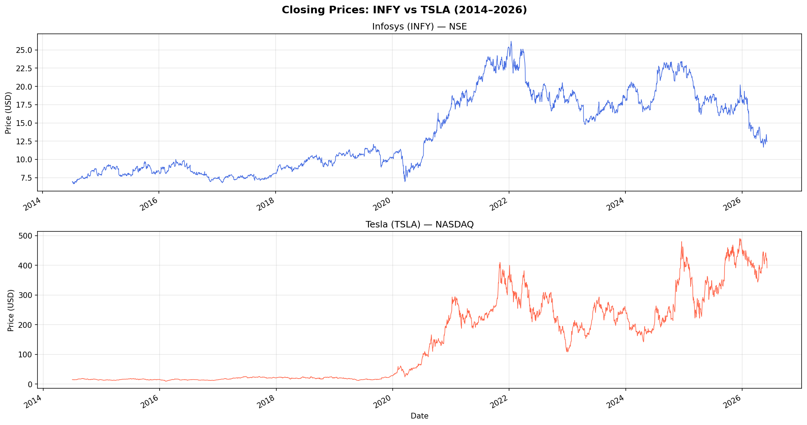
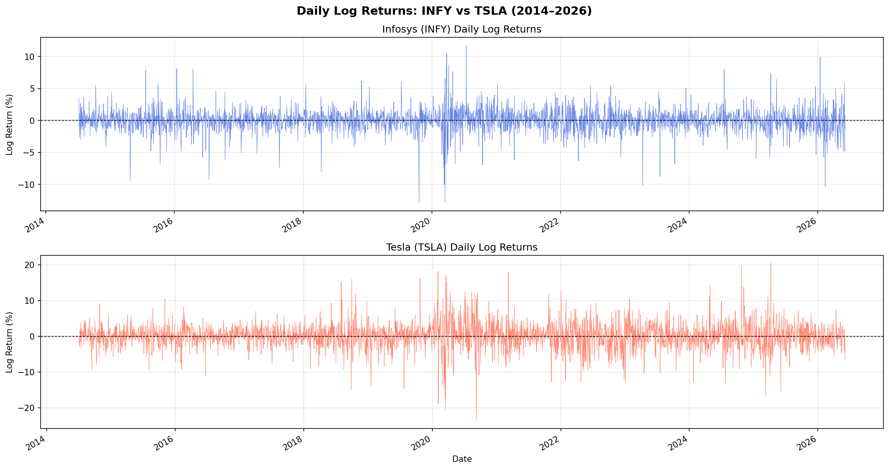
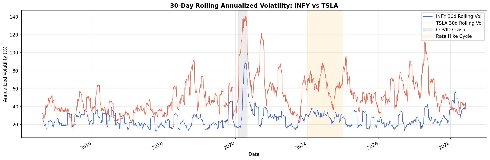
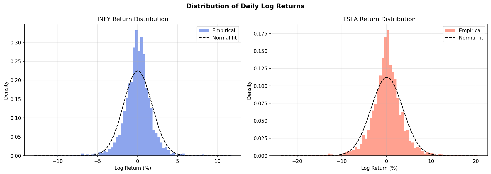
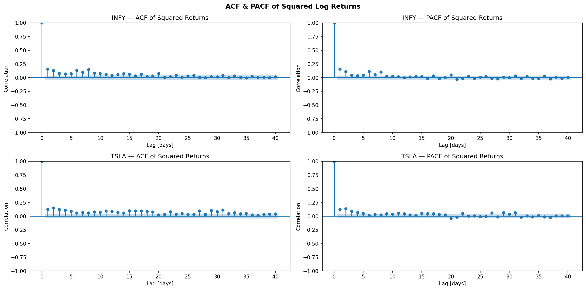
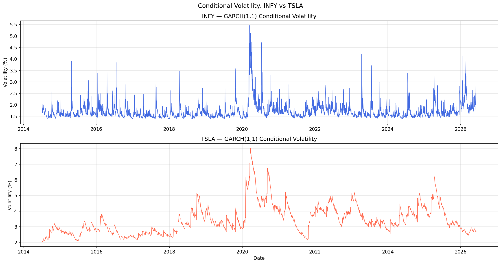
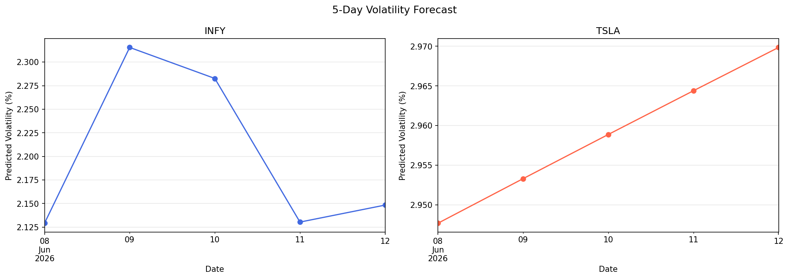
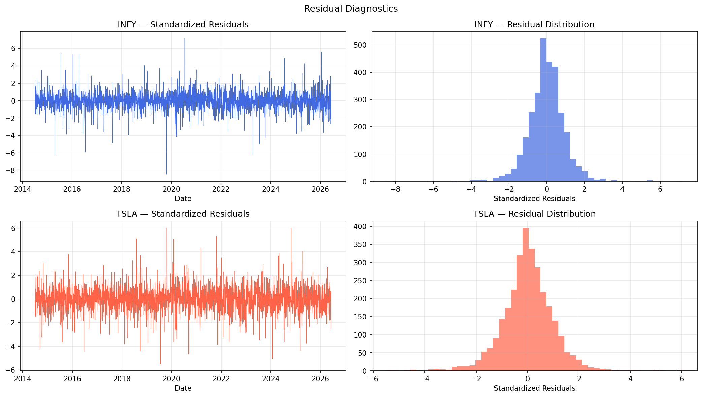

# Cross-Market Volatility Forecasting: Infosys vs Tesla

## Objective
Build an end-to-end volatility forecasting system using GARCH models — covering data ingestion, statistical modelling, multi-step forecasting, and API deployment — applied to two structurally different equities namely, INFY (NSE) and TSLA (NASDAQ) across two markets.

## Table of Contents

- [Abstract & Overview](#abstract--overview)
- [System Architecture](#system-architecture)
- [Repository Structure](#repository-structure)
- [Core Subsystems](#core-subsystems)
  - [Data Collection & Storage](#1-data-collection--storage)
  - [Exploratory Data Analysis](#2-exploratory-data-analysis)
  - [Volatility Modelling](#3-volatility-modelling)
  - [Forecasting & Risk](#4-forecasting--risk)
  - [API Layer](#5-api-layer)
- [Key Results](#key-results)
- [Getting Started](#getting-started)
- [Finance Theory](#finance-theory)


---

## Abstract & Overview

Volatility measures how much an asset's price fluctuates and is the central quantity in financial risk management. Modern financial markets exhibit a well-documented empirical phenomenon: volatility is not constant. Large price moves cluster together, fat tails appear in return distributions, and market stress events propagate across time in a structured, predictable way. This property — known as volatility clustering — is what GARCH (Generalised AutoRegressive Conditional Heteroskedasticity) models are designed to capture.

This project implements the full quantitative pipeline: from raw OHLCV data through statistical modelling, multi-step forecasting, residual diagnostics, and Value at Risk estimation — for two structurally different equities across two different markets.

-Infosys (INFY) represents a mature, large-cap Indian IT company with moderate, event-driven volatility. 
-Tesla (TSLA), speculative, sentiment-driven US EV company, represents one of the most volatile large-cap equities on NASDAQ, with near-integrated volatility persistence. 

The contrast between the two reveals how a single model class adapts to fundamentally different risk profiles.

The project is wrapped in a FastAPI application that exposes `/fit` and `/predict` endpoints — making the forecasting pipeline consumable programmatically, the same way a real financial data product would work.

---

## System Architecture

The system follows a layered pipeline design:

```
Data Layer          TwelveData API → SQLite (via SQLRepository)
                            |
Processing Layer    Log Returns → Summary Statistics → EDA
                            |
Modelling Layer     GARCH Order Selection (AIC) → GARCH(1,1) Fit
                            |
Output Layer        Conditional Volatility → 5-Day Forecast → VaR (95%)
                            |
API Layer           FastAPI /fit → /predict
```

Two parallel tracks run through the modelling layer — one for INFY, one for TSLA —
with independent model fitting, saving, and serving.

---

## Repository Structure

```
├── config.py                  # Settings and environment variable loading
├── data.py                    # TwelveData API client + SQLite repository
├── model.py                   # GarchModel class + select_garch_order utility
├── main.py                    # FastAPI application
├── volatility_analysis.ipynb  # End-to-end analysis notebook
├── models/                    # Saved GARCH model files 
├── plots/                     # Generated plots (.png)
├── stocks.sqlite              # Local SQLite database
├── theory.md                  # Finance formulas and concepts
├── requirements.txt
└── .env                       # API keys 
```

---

## Core Subsystems

### 1. Data Collection & Storage

Daily OHLCV data is fetched from the **Twelve Data API** — 3,000 trading days per ticker, covering July 2014 to June 2026. Data is persisted in a local **SQLite** database via a `SQLRepository` class that wraps `pandas.to_sql` and `pandas.read_sql`, keeping the data layer fully decoupled from the modelling layer.

### 2. Exploratory Data Analysis

Log returns are computed as $r_t = \ln(P_t / P_{t-1}) \times 100$. 

EDA covers:
- Closing price history (2014–2026)
- Daily log returns — volatility clustering visible to the eye
- 30-day rolling annualised volatility — macro regime shifts annotated
- Return distributions — empirical vs normal fit, fat tails confirmed
- ACF & PACF of squared returns — ARCH effect statistically confirmed for both tickers

### 3. Volatility Modelling

All combinations of p, q ∈ {1, 2, 3} are evaluated using AIC/BIC to select the optimal GARCH specification. Both tickers converge to **GARCH(1,1)** — consistent with decades of empirical literature showing it captures daily equity volatility dynamics with just three parameters.

A key finding: TSLA's persistence (α + β ≈ 0.99) is near-integrated, meaning volatility shocks are almost permanent — reflecting its sentiment-driven price action. INFY's persistence (α + β ≈ 0.40) is significantly lower, consistent with faster mean reversion in a stable, contract-driven business.

### 4. Forecasting & Risk Estimation

A 5-day volatility forecast is generated from each fitted model — variance forecast converted to daily volatility and annualised (×√252). **Parametric Value at Risk (95%)** is then estimated directly from the forecast:

VaR₉₅% = −(μ − 1.645 × σ_forecast)

where:
- μ = expected return
- σ_forecast = forecasted volatility
- 1.645 = z-score for a one-tailed 95% confidence level

At 95% confidence, TSLA's daily VaR is approximately 1.3X that of INFY, reflecting its structurally higher risk profile across the full forecast horizon.

### 5. API Layer

A **FastAPI** application wraps the trained models with two endpoints:

| Method | Endpoint | Description |
|--------|----------|-------------|
| `POST` | `/fit` | Fetch or reuse data, fit GARCH model, save to disk |
| `POST` | `/predict` | Load most recent saved model, return volatility forecast |

Run with:
```bash
uvicorn main:app --reload --host localhost --port 8008
```

Interactive docs at `http://localhost:8008/docs`

---

## Key Results

| Metric | INFY | TSLA |
|---|---|---|
| Market | NSE (India) | NASDAQ (US) |
| Data range | Jul 2014 – Jun 2026 | Jul 2014 – Jun 2026 |
| Mean daily return % | 0.0204 | 0.1081 |
| Annualised return % | 5.15 | 27.23 |
| Annualised volatility % | 28.22 | 56.40 |
| Skewness | -0.34 | -0.05 |
| Kurtosis | 6.65 | 4.46 |
| GARCH model | GARCH(1,1) | GARCH(1,1) |
| Persistence (a+b) | 0.3965 | 0.9923 |
| 5-day avg forecast vol % | 2.21 | 2.96 |
| VaR 95% avg | 3.61% | 4.76% |

TSLA is roughly 2x more volatile than INFY. Its near-integrated persistence (0.9923)
means volatility shocks linger for a very long time — visible in the COVID crash spike
that took months to decay. INFY shocks dissipate quickly (0.3965), consistent with
sharp event-driven spikes from earnings surprises that resolve within days.

---

## Plots

### Closing Prices (2014–2026)


### Daily Log Returns


### 30-Day Rolling Annualised Volatility


### Return Distributions


### ACF & PACF of Squared Returns


### Conditional Volatility — GARCH(1,1)


### 5-Day Volatility Forecast


### Residual Diagnostics


---

## Getting Started

### 1. Clone and install
 
```bash
git clone <your-repo-url>
cd volatility_forecaster
python -m venv .venv && source .venv/bin/activate
pip install -r requirements.txt
```
 
### 2. Configure environment
 
```bash
cp .env.example .env
# Paste your Twelve Data API key into .env
```
 
### 3. Run the notebook
 
```bash
jupyter notebook volatility_analysis.ipynb
```
 
Run all cells top-to-bottom. Data is fetched, stored, modelled, and all plots are saved to `plots/`.
 
### 4. API reference

```
 
### `POST /fit`
```json
{
  "ticker": "INFY",
  "use_new_data": false,
  "n_observations": 3000,
  "p": 1,
  "q": 1
}
```
Trains a GARCH(p,q) model and saves it to `models/`. Set `use_new_data: true` to pull fresh data before training.
 
### `POST /predict`
```json
{ "ticker": "TSLA", "n_days": 5 }
```
Returns a dict of `{ "YYYY-MM-DD": annualised_volatility_pct }` for each forecast business day.
 
---

## Dependencies
 
| Package | Purpose |
|---------|---------|
| `arch` | GARCH model estimation |
| `fastapi` + `uvicorn` | REST API |
| `pydantic-settings` | Environment config |
| `pandas` + `numpy` | Data wrangling |
| `matplotlib` + `scipy` | Visualisation |
| `statsmodels` | ACF/PACF diagnostics |
| `joblib` | Model serialisation |
| `requests` | API data ingestion |
| `sqlite3` | Local data storage |

---

## Finance Theory

See [theory.md](theory.md) for detailed derivations and formulas covering:

- Log returns and why they are preferred over simple returns
- Annualised return and volatility
- Volatility clustering and the ARCH effect
- GARCH(p,q) variance equation and parameter interpretation
- Volatility persistence (alpha + beta)
- AIC and BIC for model order selection
- Multi-step volatility forecasting and mean reversion
- Parametric Value at Risk at 95% confidence

---

